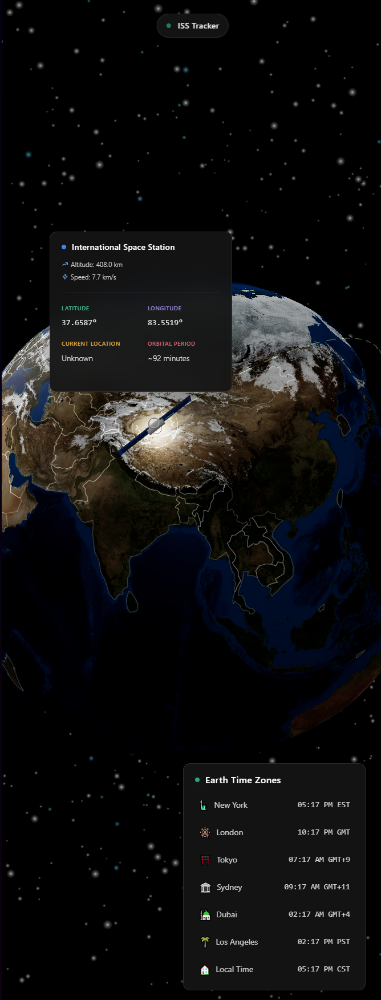

# 3D Globe ISS Tracker

>[!TIP]
>Check out the live demo [here](https://3d-globe-iss-tracker.pages.dev/)

Welcome to the 3D Globe ISS Tracker! This project visualizes the International Space Station's (ISS) position in real-time on a 3D globe, providing a stunning and interactive experience.

## Features

- **Real-time ISS Tracking**: Follow the ISS as it orbits the Earth.
- **Interactive 3D Globe**: Explore the globe with intuitive controls.
- **Detailed ISS Information**: View altitude, speed, and current location.
- **Earth Time Zones**: Check the current time in major cities around the world.

## Screenshot



## Installation

1. Clone the repository:
   ```bash
   git clone https://github.com/jhomra21/3d-globe-iss-tracker.git
   ```
2. Navigate to the project directory:
   ```bash
   cd 3d-globe-iss-tracker
   ```
3. Install dependencies:
   ```bash
   bun install
   ```
4. Start the development server:
   ```bash
   bun run dev
   ```

## Usage

- Open your browser and navigate to `http://localhost:3000` to view the tracker.
- Use your mouse to interact with the globe and explore different features.

## Technologies Used

- **Solid.js**: A declarative JavaScript library for building user interfaces.
- **Three.js**: A powerful 3D graphics library.
- **D3.js**: A JavaScript library for producing dynamic, interactive data visualizations.


---

Enjoy tracking the ISS with this interactive 3D globe!